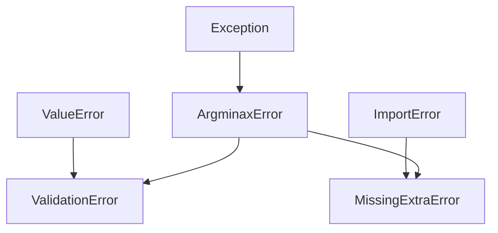

# Exceptions

Every error raised by the package derives from [`ArgminaxError`][argminax.ArgminaxError] *and* from the closest standard-library exception.

```mermaid
graph TD
    E[Exception] --> A[ArgminaxError]
    V[ValueError] --> VE[ValidationError]
    A --> VE
    I[ImportError] --> ME[MissingExtraError]
    A --> ME
```

::: argminax.exceptions
